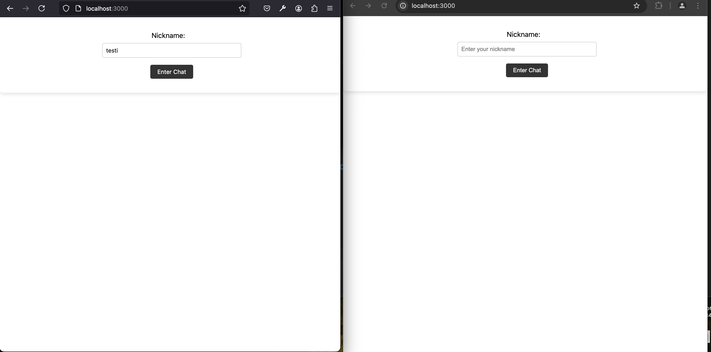
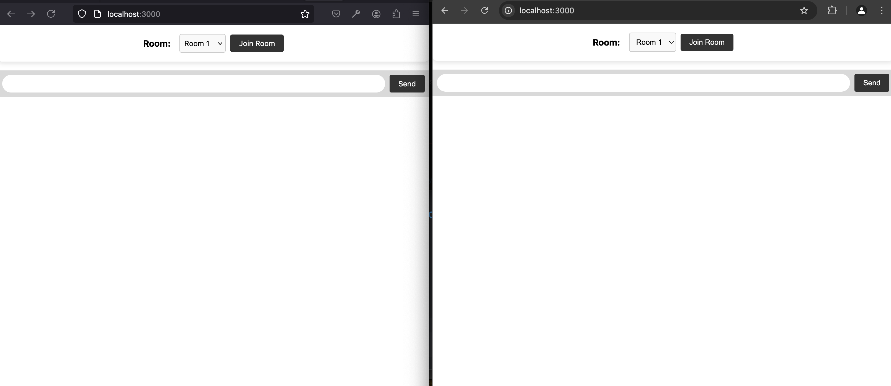
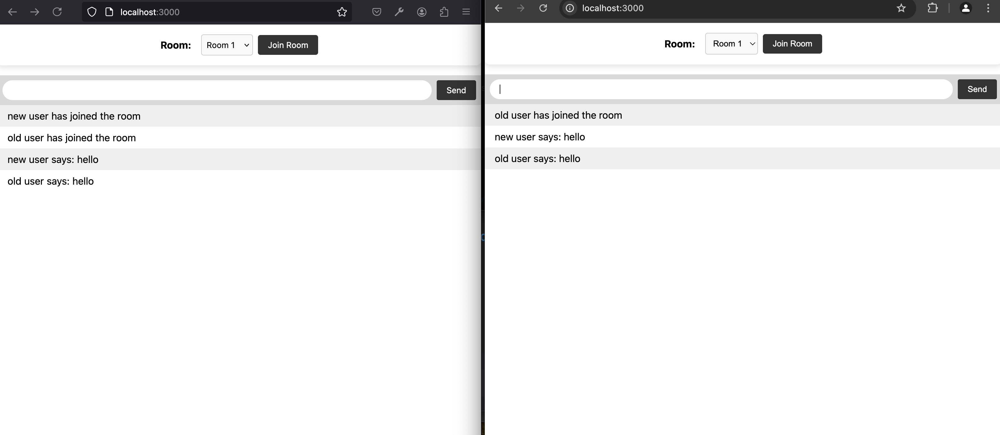
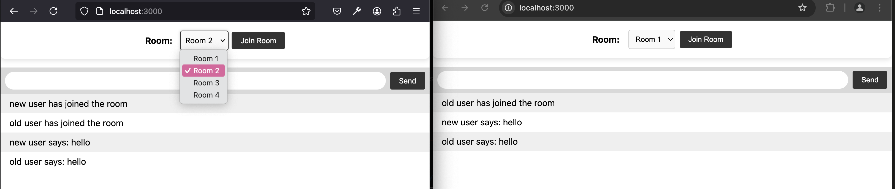
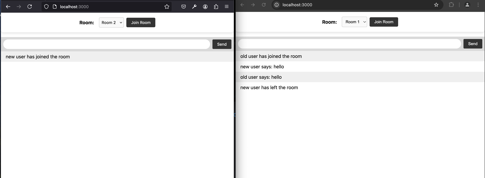
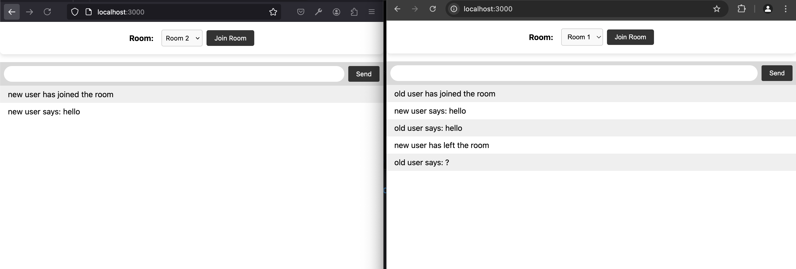
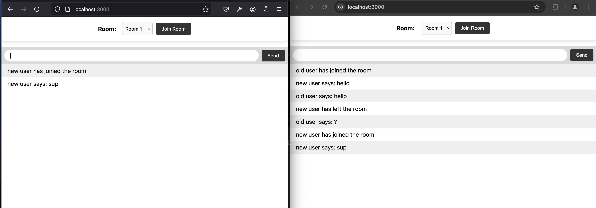
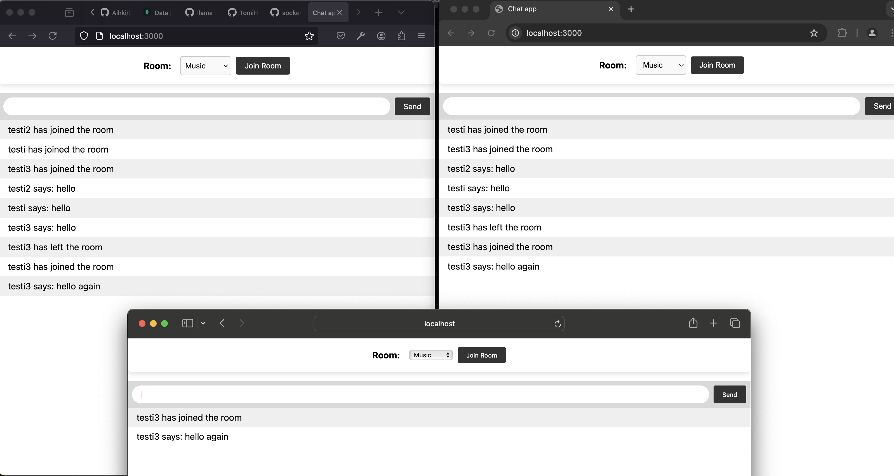
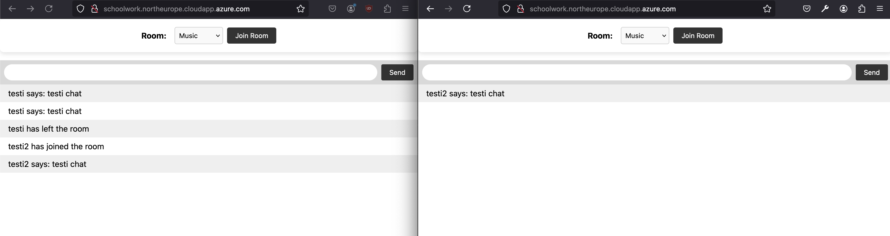

# WebChat Application

käytetty tutoriaalia mikä opettaja oli antanut ja tästä lähetty uudistamaan tätä sekä lisätty muutamia uusia toimintoja. Vaihdoin var -> const. sekä tein omat tiedostot js ja tyyleille. Laitettu dockerin conttiin pyörimään locaalisti.

nimiavaruus

Nimiavaruus(namespace) jakaa yhteyden eri kanaville. Tällä saadaan loogisuutta ohjelmaan.. Esimerkiksi oletusnimiarvaruus on (‘/‘), Tässä ohjelmassa voisi käyttää tälläistä nimiavaruuksia
    - (‘/chat’), jossa keskustelu tapahtuu
    - (‘/rules’),jossa voisi olla palvelun säännöt
    - (‘/admin’), admineille tarkoitettu

Huoneilla sitten tarkemmin jaetaan nimiavaruuden sisällä yhteyksiä. Roomit/huoneet sopivat hyvin semmoisiin tilanteisiin kun haluat jakaa keskustelut pienempii ryhmiin ja nämä viestit näkyvät vain tähän room/huoneeseen. Esimerkiksi tässä tapauksessa ne voitaisiin jakaa aihealuettain.
    - huone 1 Musiikki
    - huone 2 kirjallisuus
    - huone 3 ajankohtaiset
    - jne.

viimeisen osan pientä selostusta mitä tein
Yritin saada toimimaan ensiksi dockerin kautta mutta sitten huomasin että ohjeissa käytettiin aws. Elikkä Dockerissa se toimii vaan locaalisesti. Sitten katsoin miten saisin sen suoraan Azureen Web PubSub for Socket.IO kanssa . Tein siitä ohjeiden mukaan mitä linkin kautta löysin ja lisäsin serverille tieodsto(websocket ja serveri on samassa groupissa). Vähän säätelyiden jälkeen näytti toimivan monellilla node ja dockerissa VM kautta.

## Screenshots
### Entering Name
Nimi kentä tulee ensiksi näkymään

### Chat Screen
tyhjä chat screen jossa voi valita huoneen. simpellin näiköinen se.

### Chatting in a Room
Keskustelua huoneessa. kummatkin näkee oman viestinsä ja sekä toisen laittaman. Tästä näkee myös kuka liittyy ja kuka poistuu sekä kuka on laittanut tietyn viestin.

### Selecting Room
toinen käyttäjä vaihtanut huonetta ja kirjoittaa sinne. Huoneita on valmiiksi tehty 4 ja ne valitaan dropvalikosta ja tämän jälkeen painaa join room. Kun vaihdat huonetta niin edellisestä huoneesta tämä käyttäjä disconnectataan sekä hän ei näe vahoja viestejä enään.

### Joining Another Room

### Chatting in Another Room

### Going Back to First Room
menee takaisin ensimmäiseen huoneeseen

### Tree user at the same time
kolme käyttäjää missä yksi on kerran vaihtanut kanavaa ja tullut takaisi

### azure sekä Web PubSub for Socket.IO
sain laitettua azureen sekä Web PubSub for Socket.IO. Näytti toimivan node ja dockerilla

